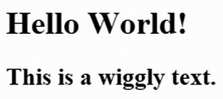

# Wiggly Text

A lightweight JavaScript package that adds a wiggly animation to any HTML element with the `.wiggly-text` class.

# Installation

**Via npm**
```bash
npm install @hesselst/wigglytext
```

**Via CDN**
```html

```

## Usage/Examples

Add the class to any element containing text:
```
<h1 class="wiggly-text">Hello World!</h1>
```

## Showcase



## 🔗 Links

- [npm](https://www.npmjs.com/package/@hesselst/wiggly-text)
- [GitHub](https://github.com/Hesselst/wiggly-text)
